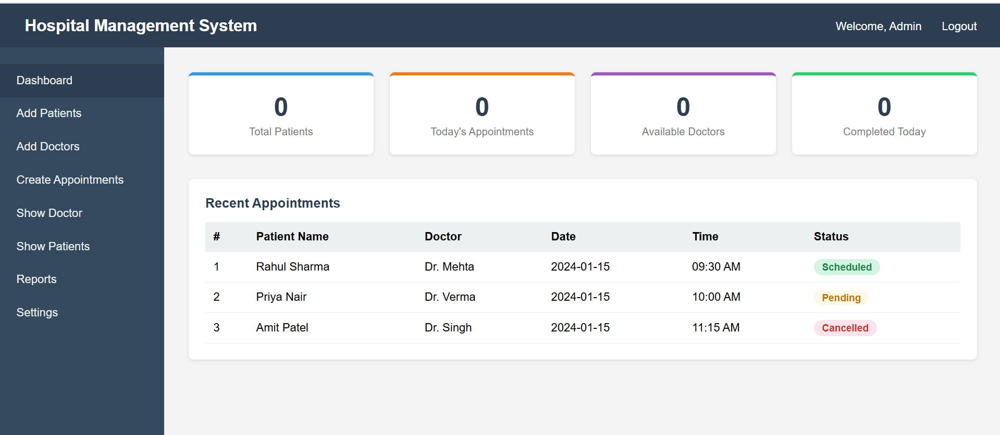

# Hospital Management System

A full stack web application developed using Java technologies for managing hospital operations such as doctor management, patient management, and appointments.

---

## Technologies Used

### Backend
- Java
- Servlet
- JSP
- Hibernate
- JPA

### Frontend
- HTML
- CSS
- Bootstrap

### Database
- PostgreSQL

### Build Tool
- Maven

### IDE
- Eclipse IDE

---

## Features

- Doctor Management
- Patient Management
- Appointment Booking
- User Authentication
- CRUD Operations
- Database Connectivity using Hibernate JPA
- MVC Architecture

---

## Project Structure

```text
src/main/java
│
├── controller
├── dao
├── entity
├── service
└── util

src/main/resources
│
└── META-INF
    └── persistence.xml

src/main/webapp
│
├── WEB-INF
├── css
├── js
└── jsp pages
```

---

## How to Run the Project

### 1. Clone Repository

```bash
git clone https://github.com/yourusername/hospital-management-system.git
```

### 2. Import Project

Import the project into Eclipse as an Existing Maven Project.

### 3. Configure Database

- Install PostgreSQL
- Create database
- Update database configuration in `persistence.xml`

### 4. Run on Server

Run the project using Apache Tomcat Server.

---

## Maven Dependencies

Main dependencies used:
- Hibernate ORM
- PostgreSQL Driver
- Servlet API
- JSP API

---

## Screenshots

### Dashboard


---

## Author

Developed by Bapurao Jadhav

---

## License

This project is for educational and learning purposes.
